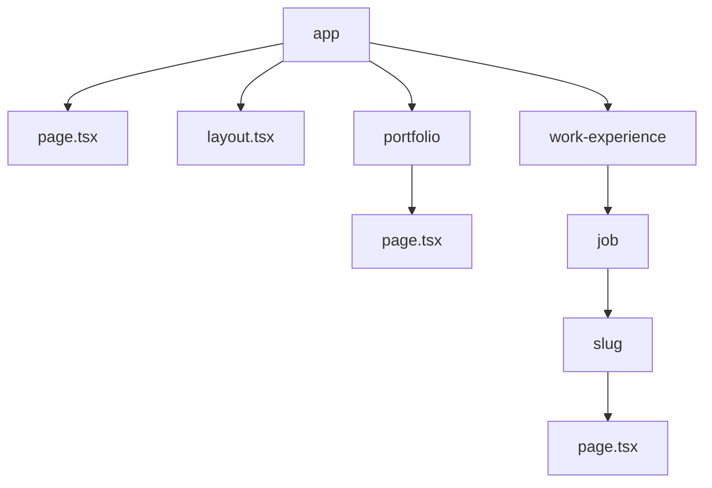
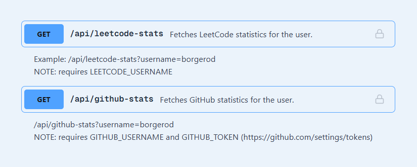
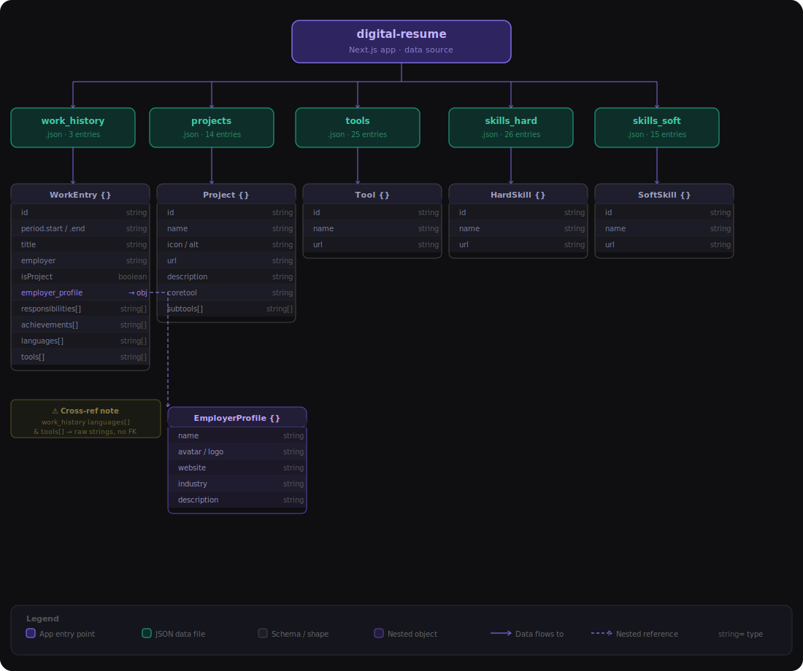

# DigitalResume <span style="font-size:0.5em;"><em> - borgerod.no / borgerod.github.io</em></span>

### <span style="font-size:0.8em;">Description</span>

A digital resume and portfolio platform designed to showcase your professional experience, skills, and projects.

Built with Next.js, it features interactive components, structured work history, and project galleries. The site serves as both a personal branding tool and a dynamic CV, providing visitors with an organized overview of your background, achievements, and contact options. It also includes integrations for analytics, SEO, and links to external resources like GitHub and Figma.

### Technology Overview

| Category        | Technology / Tool       | Version    |
| --------------- | ----------------------- | ---------- |
| Framework       | Next.js                 | 16.1.7     |
| Language        | TypeScript              | 5.9        |
| Styling         | Tailwind CSS            | 4.2        |
| UI kit          | Hero UI                 | 3.0 (beta) |
| Deployment      | Vercel                  | -          |
| Package Manager | npm / yarn / pnpm / bun | latest     |
| Data structure  | JSON                    | -          |

<!-- TODO finish  -->

## Table of contents:

- [DigitalResume - borgerod.no / borgerod.github.io](#digitalresume----borgerodno--borgerodgithubio)
  - [Description](#description)
  - [Technology Overview](#technology-overview)
  - [Table of contents:](#table-of-contents)
  - [TODO:](#todo)
    - [Necessary](#necessary)
    - [Optional](#optional)
  - [Page Map](#page-map)
  - [Data Overview](#data-overview)
    - [API Map](#api-map)
    - [Data Map](#data-map)
  - [Previews](#previews)
  - [Previews](#previews-1)
  - [Usage - how to install and run project](#usage----how-to-install-and-run-project)
    - [Installation](#installation)
    - [Deploy on Vercel](#deploy-on-vercel)

## TODO:

_a compilation of all todos for the repo._ <br>
_all of the todos found in the project files **should** be referenced here_

### <span style="font-size:0.8em;">Necessary</span>

- [ ] make readme look structured and nice
  - [x] add page map
  - [x] add previews
  - [x] add description
  - [ ] add description of ['layoutBuilder' ,'BentoBoxBuilder']
  - [x] add table of contents
  - [ ] add hyperlink to bug-report
  - [ ] make usage guide; (what images the user needs to add, and what data user needs to add and how it needs to be structured. )
  - [x] improve installation guide
- [ ] BUG (3.0) fix bug in ImageGallery where image view sometimes refuses to close.
- [ ] BUG (4.0) fix Images wont open on mobile mode (maybe other popups?)
- [ ] Analytics / SEO / AEO
  - [ ] add vercel analytics
  - [ ] enable vercel speed insight
  - [ ] implement SEO/AEO
    - [x] add metadata
    - [ ] inplement SEO/AEO analysis
- [x] add button redirecting to 'Github-repo' and 'Figma-project' in home
- [ ] WorkHistoryCard -> get feedback and pick color option 1 or 2 for chips

### <span style="font-size:0.8em;">Optional</span>

- [ ] make ['layoutBuilder' ,'BentoBoxBuilder'] - 2.0:
  - [ ] make generator for 'layoutList'
  - [ ] look into more efficiant alternative algorithms
  - [ ] fine tune logic: something changed and the output is not optimal.
- [ ] Maybe turn BentoBoxBuilder into a stand-alone package. it seems usefull maybe other ones might like it.
- [ ] Maybe turn DigitalResume (this app) into a dynamic repo so other people can use it.
  - [ ] make the input of data simpler
  - [ ] make more robust stringhandler
- [ ] update job banners (logo long)
- [ ] make profile image maker that automatically removed background and crops accordingly. no manual laber.
- [ ] add tracking of visitors? note: prob would break gdpr but its a private website and I am tracking information of legal entities (employees of a business) and not private individual's personal data, so whatever.

## Page Map



## Data Overview

### API Map



### Data Map



## Previews

Here are some previews of the Digital Resume platform in action:

## Previews

<details>
<summary>Home (Desktop)</summary>
<br>


</details>

<details>
<summary>Home (Mobile)</summary>
<br>

| Mobile 1
| --------------------------------------------------------------------
| 
| 

</details>

<details>
<summary>Home (iPad)</summary>
<br>


</details>

<details>
<summary>Job-page</summary>
<br>

full view of all jobs

closer look


Image gallery


</details>

<details>
<summary>Portfolio-page</summary>
<br>

| Portfolio
| -----------------------------------------------------------------
| 

</details>

## Usage <span style="font-size:0.5em;"><em> - how to install and run project</em></span>

This is a [Next.js](https://nextjs.org) project bootstrapped with [`create-next-app`](https://nextjs.org/docs/app/api-reference/cli/create-next-app).

yarn dev

### Installation

1. Clone the repository:

```bash
git clone https://github.com/Borgerod/Borgerod.github.io.git
cd Borgerod.github.io
```

2. Install dependencies (choose one):

```bash
npm install
# or
yarn install
# or
pnpm install
# or
bun install
```

3. Start the development server (choose one):

```bash
npm run dev
# or
yarn dev
# or
pnpm dev
# or
bun dev
```

4. Open [http://localhost:3000](http://localhost:3000) in your browser.

### Deploy on Vercel

NOTE: this is not a static site and cannot be used as a github.io, you have to host it somewhere else like vercel. to host it on github you need to replace the API data with static data. (will come in a future update)

The easiest way to deploy your Next.js app is to use the [Vercel Platform](https://vercel.com/new?utm_medium=default-template&filter=next.js&utm_source=create-next-app&utm_campaign=create-next-app-readme) from the creators of Next.js.

Check out our [Next.js deployment documentation](https://nextjs.org/docs/app/building-your-application/deploying) for more details.
