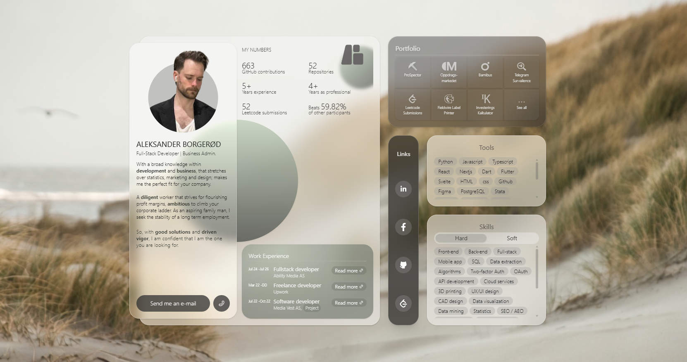
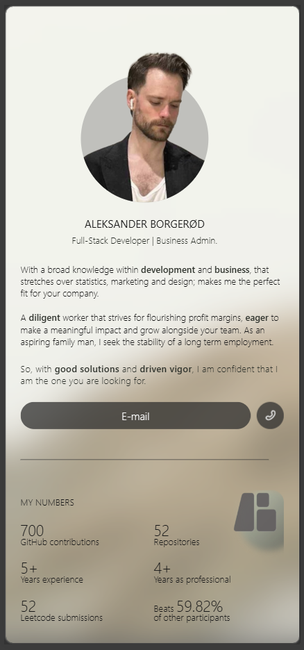
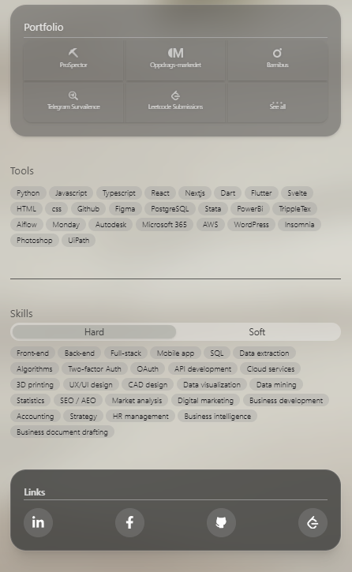
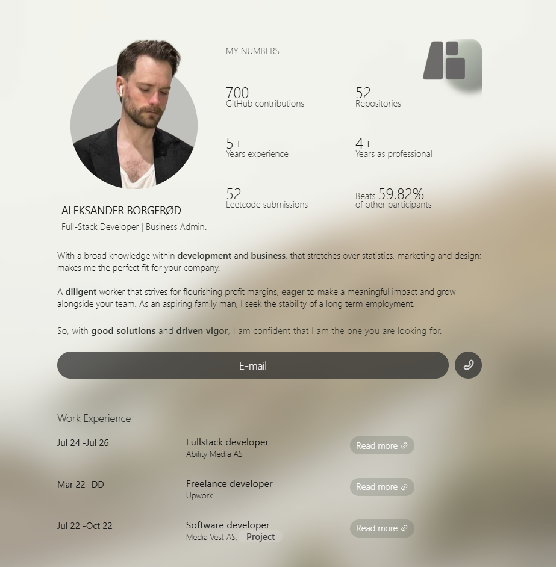
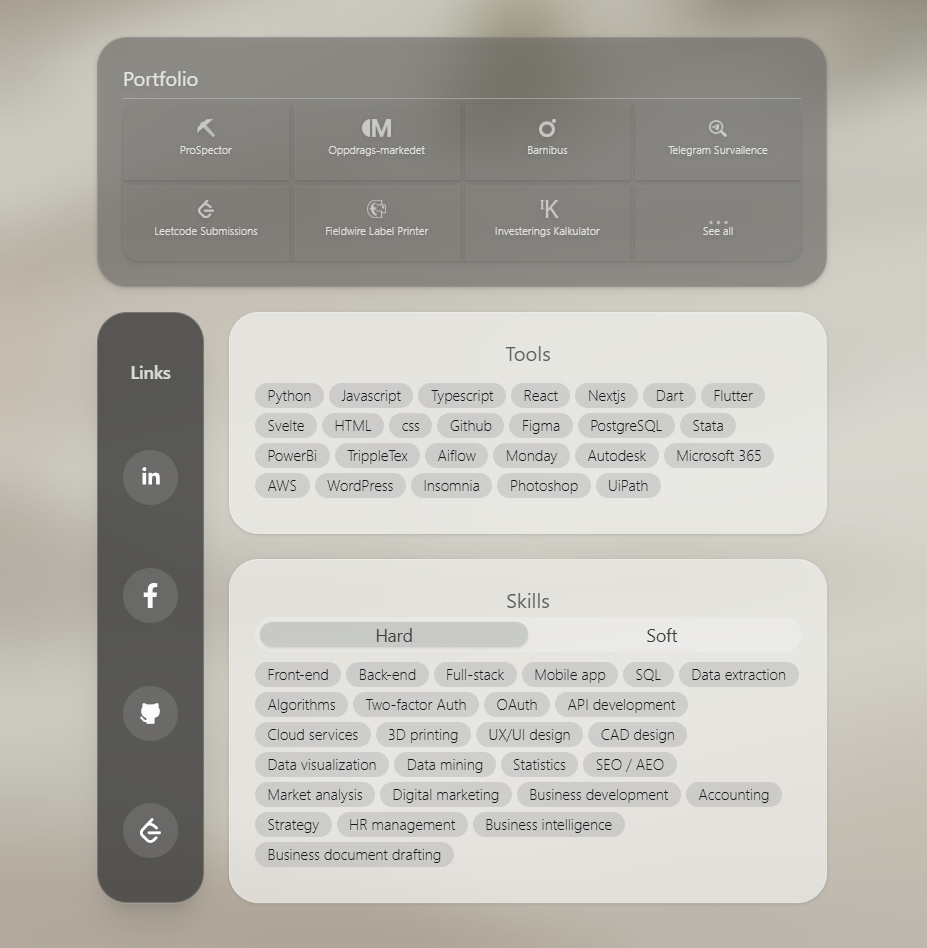
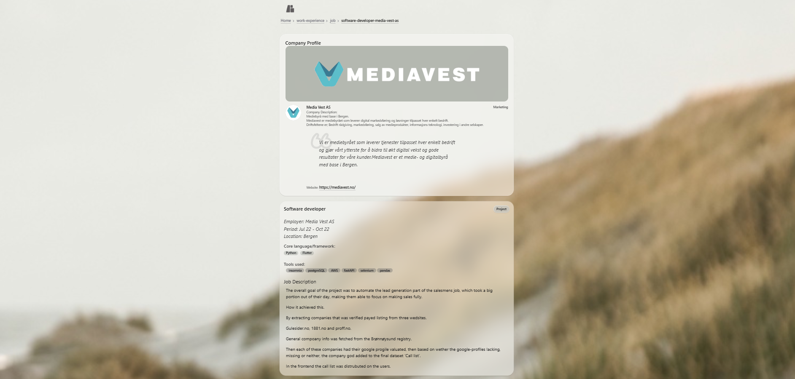
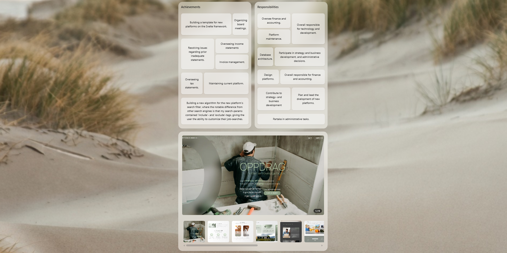
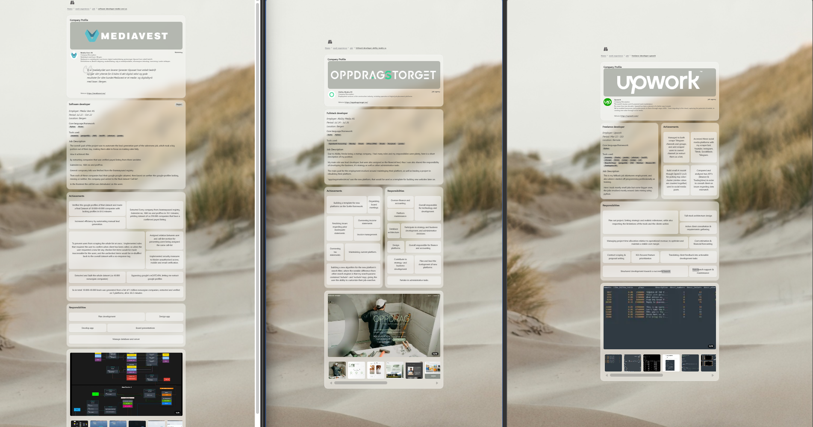
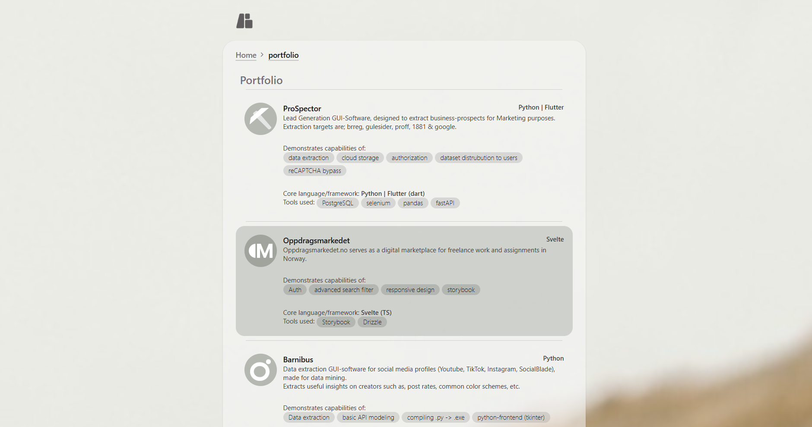
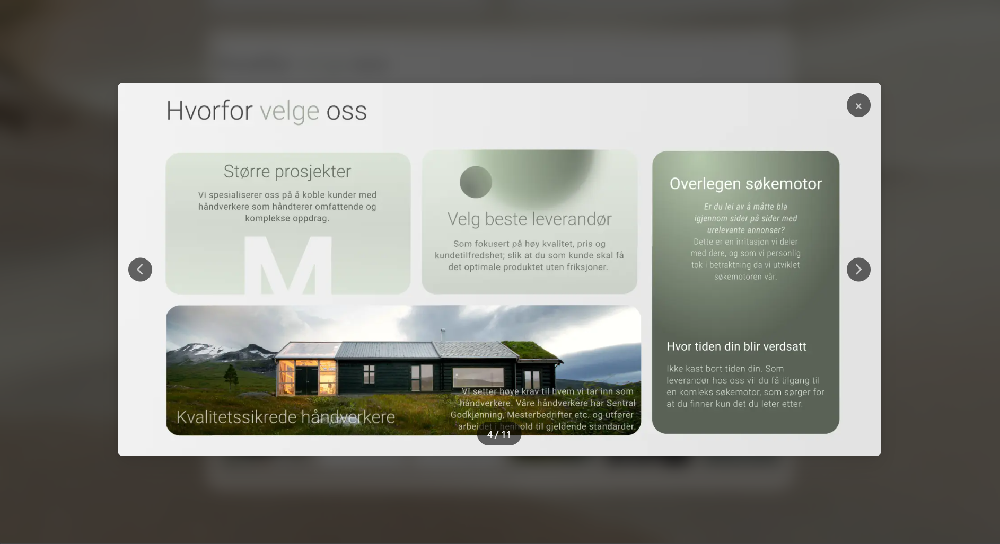

# DigitalResume <span style="font-size:0.5em;"><em> - borgerod.no / borgerod.github.io</em></span>

### <span style="font-size:0.8em;">Description</span>

A digital resume and portfolio platform designed to showcase your professional experience, skills, and projects.

Built with Next.js, it features interactive components, structured work history, and project galleries. The site serves as both a personal branding tool and a dynamic CV, providing visitors with an organized overview of your background, achievements, and contact options. It also includes integrations for analytics, SEO, and links to external resources like GitHub and Figma.

### Technology Overview

| Category        | Technology / Tool       | Version    |
| --------------- | ----------------------- | ---------- |
| Framework       | Next.js                 | 16.1.7     |
| Language        | TypeScript              | 5.9        |
| Styling         | Tailwind CSS            | 4.2        |
| UI kit          | Hero UI                 | 3.0 (beta) |
| Deployment      | Vercel                  | -          |
| Package Manager | npm / yarn / pnpm / bun | latest     |
| Data structure  | JSON                    | -          |

<!-- TODO finish  -->

## Table of contents:

- [DigitalResume  - borgerod.no / borgerod.github.io](#digitalresume----borgerodno--borgerodgithubio)
    - [Description](#description)
    - [Technology Overview](#technology-overview)
  - [Table of contents:](#table-of-contents)
  - [TODO:](#todo)
    - [Necessary](#necessary)
    - [Optional](#optional)
  - [Page Map](#page-map)
  - [Data Map](#data-map)
    - [API Map](#api-map)
      - [local](#local)
      - [external](#external)
    - [Static Datasets](#static-datasets)
  - [Previews](#previews)
  - [Previews](#previews-1)
  - [Usage  - how to install and run project](#usage----how-to-install-and-run-project)
    - [Getting Started](#getting-started)
    - [Learn More](#learn-more)
    - [Deploy on Vercel](#deploy-on-vercel)

## TODO:

_a compilation of all todos for the repo._ <br>
_all of the todos found in the project files **should** be referenced here_

### <span style="font-size:0.8em;">Necessary</span>

- [ ] make readme look structured and nice
  - [ ] add page map
  - [ ] add previews
  - [x] add description
  - [ ] add description of ['layoutBuilder' ,'BentoBoxBuilder']
  - [x] add table of contents
  - [ ] add hyperlink to bug-report
- [ ] BUG (2.0) fix bug in ImageGallery where image view sometimes refuses to close.
- [ ] implement SEO/AEO
- [ ] add button redirecting to 'Github-repo' and 'Figma-project' in home
- [ ] add analytics
- [ ] enable speed insight
- [ ] inplement SEO/AEO analysis
- [ ] add tracking of visitors? note: prob would break gdpr but its a private website and I am tracking information of legal entities (employees of a business) and not private individual's personal data, so whatever.

### <span style="font-size:0.8em;">Optional</span>

- [ ] make ['layoutBuilder' ,'BentoBoxBuilder'] - 2.0:
  - [ ] make generator for 'layoutList'
  - [ ] look into more efficiant alternative algorithms
  - [ ] fine tune logic: something changed and the output is not optimal.
- [ ] Maybe turn BentoBoxBuilder into a stand-alone package. it seems usefull maybe other ones might like it.
- [ ] Maybe turn DigitalResume (this app) into a dynamic repo so other people can use it.
  - [ ] make the input of data simpler
  - [ ] make more robust stringhandler
- [ ] update job banners (logo long)

## Page Map

<!-- TODO finish  -->

## Data Map

### API Map

#### local

#### external

### Static Datasets

<!-- TODO finish  -->

## Previews

Here are some previews of the Digital Resume platform in action:

## Previews

<details>
<summary>🖥️ Home</summary>
<br>



</details>

<details>
<summary>📱 Mobile</summary>
<br>

| Mobile 1                                                             | Mobile 2                                                             |
| -------------------------------------------------------------------- | -------------------------------------------------------------------- |
|  |  |

</details>

<details>
<summary>📟 iPad</summary>
<br>

| iPad 1                                                           | iPad 2                                                           |
| ---------------------------------------------------------------- | ---------------------------------------------------------------- |
|  |  |

</details>

<details>
<summary>💼 Jobs</summary>
<br>

| Job 1                                                     | Job 2                                                     | Full View                                                   |
| --------------------------------------------------------- | --------------------------------------------------------- | ----------------------------------------------------------- |
|  |  |  |

</details>

<details>
<summary>🖼️ Portfolio & Gallery</summary>
<br>

| Portfolio                                                         | Image Gallery                                                       |
| ----------------------------------------------------------------- | ------------------------------------------------------------------- |
|  |  |

</details>

## Usage <span style="font-size:0.5em;"><em> - how to install and run project</em></span>

This is a [Next.js](https://nextjs.org) project bootstrapped with [`create-next-app`](https://nextjs.org/docs/app/api-reference/cli/create-next-app).

### Getting Started

First, run the development server:

```bash
npm run dev
# or
yarn dev
# or
pnpm dev
# or
bun dev
```

Open [http://localhost:3000](http://localhost:3000) with your browser to see the result.

You can start editing the page by modifying `app/page.tsx`. The page auto-updates as you edit the file.

This project uses [`next/font`](https://nextjs.org/docs/app/building-your-application/optimizing/fonts) to automatically optimize and load [Geist](https://vercel.com/font), a new font family for Vercel.

### Learn More

To learn more about Next.js, take a look at the following resources:

- [Next.js Documentation](https://nextjs.org/docs) - learn about Next.js features and API.
- [Learn Next.js](https://nextjs.org/learn) - an interactive Next.js tutorial.

You can check out [the Next.js GitHub repository](https://github.com/vercel/next.js) - your feedback and contributions are welcome!

### Deploy on Vercel

The easiest way to deploy your Next.js app is to use the [Vercel Platform](https://vercel.com/new?utm_medium=default-template&filter=next.js&utm_source=create-next-app&utm_campaign=create-next-app-readme) from the creators of Next.js.

Check out our [Next.js deployment documentation](https://nextjs.org/docs/app/building-your-application/deploying) for more details.
